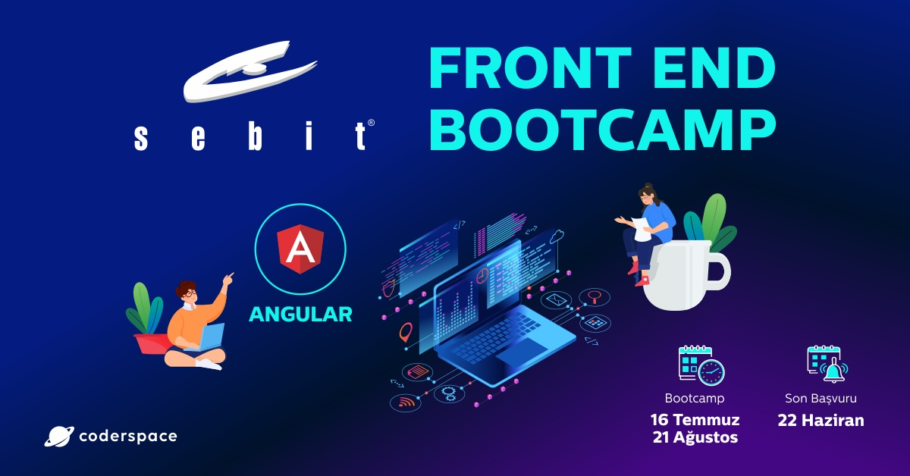
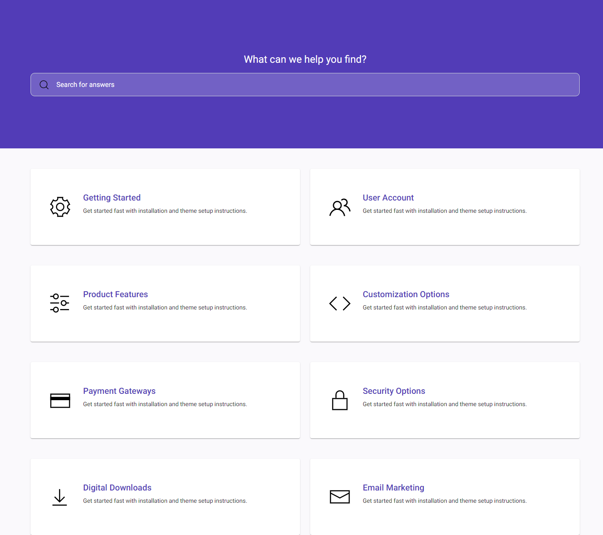
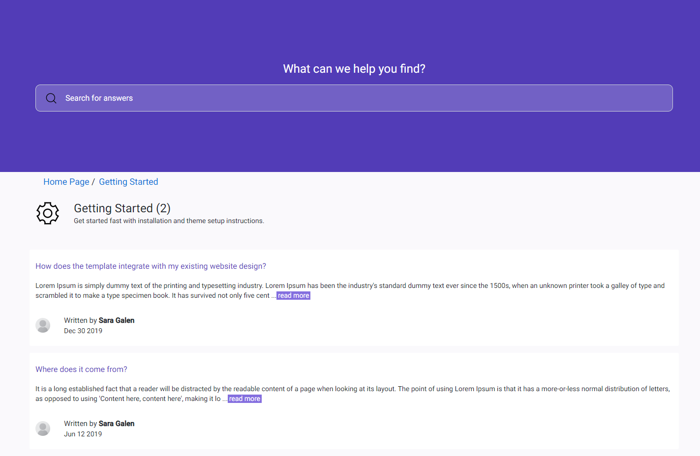
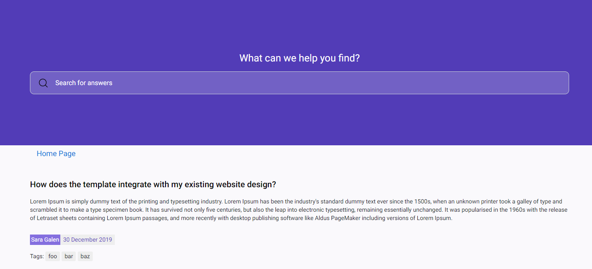
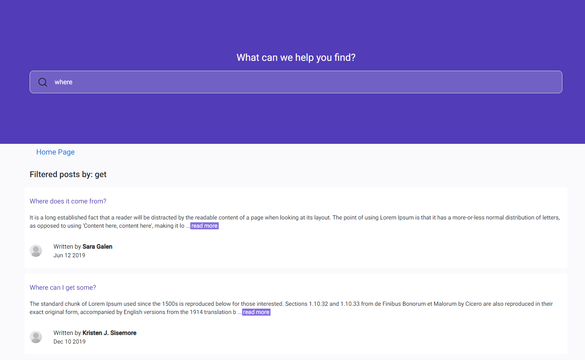
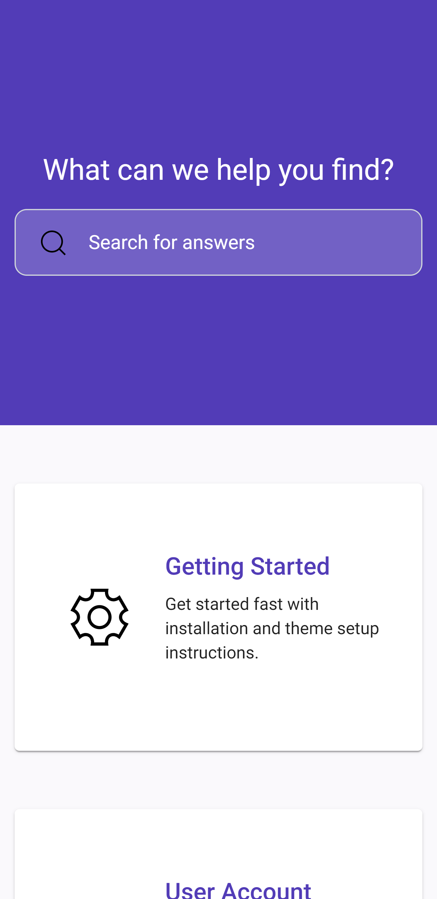
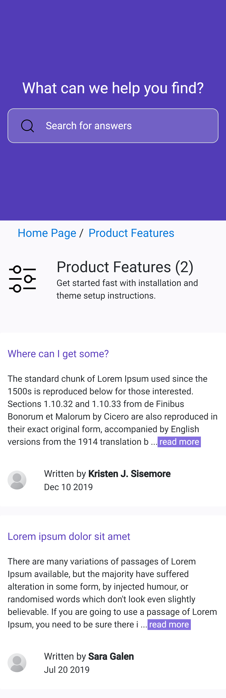
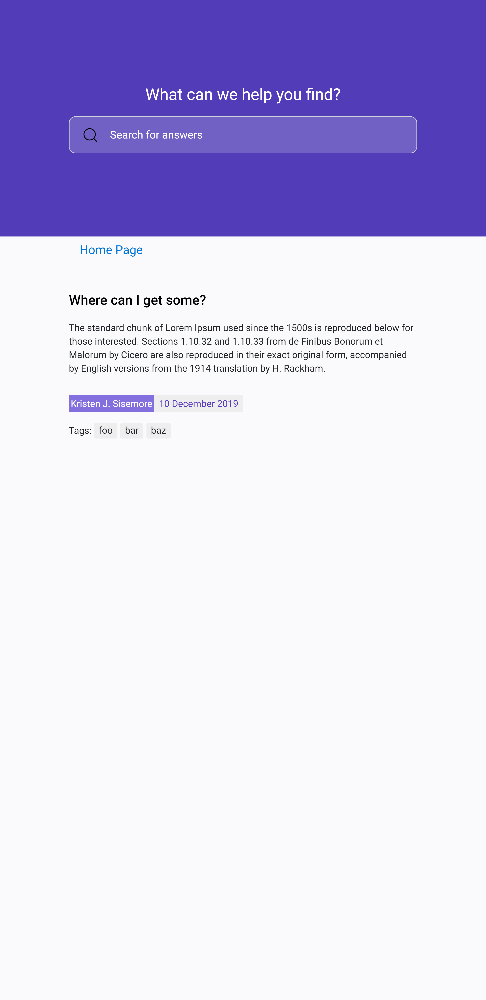
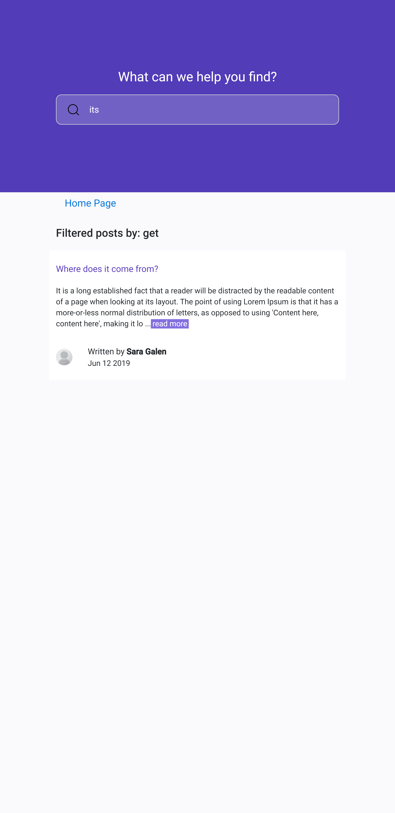

 
  
    

<h1 align="center"> Sebit Front End Bootcamp </h1>
<h3 align="center"> Bitirme Projesi </h3>

 

 
  

<!-- TABLE OF CONTENTS -->
<h2 id="table-of-contents"> :book: İçerik</h2>

  
İçerik

  <ol>
    <li><a href="#deploy"> ➤ Proje Deploy Adresi</a></li>
    <li><a href="#hakkinda"> ➤ Proje Hakkında</a></li>
    <li><a href="#teknolojiler"> ➤ Kullanılan Teknolojiler</a></li>
    <li><a href="#kurulum"> ➤ Kurulum</a></li>
    <li><a href="#endpoint"> ➤ Endpointler</a></li>
    <li><a href="#web"> ➤ Web Ekran Görüntüsü</a></li>
    <li><a href="#mobil"> ➤ Mobil Ekran Görüntüsü</a></li>      
    <li><a href="#iletisim"> ➤ İletişim ve Bilgiler</a></li>
  </ol>

<h2 id="deploy"> :pencil: Proje Deploy Adresi</h2>

<b>Proje Production:</b> <a href="https://sebit-graduation-project.herokuapp.com/home">https://sebit-graduation-project.herokuapp.com</a> 

<!-- ABOUT THE HOMEWORK -->
<h2 id="hakkinda"> :pencil: Proje Hakkında</h2>

 
<b>Proje Bilgileri:</b> 
<pre>
I.	Proje datası olarak verilen json dosyalarını kullanabilirsiniz (categories.json, posts.json)
II.	Datalara ek olarak tasarımda yer alan görseller için /resources klasörü içerisindeki dosyaları kullabilirsiniz.
III.	Tüm geliştirme tasarımı, /screenshots klasörü altında yer alan ekran gürüntüleri esas alınarak yapılacaktır.
IV.	Uygulama 4 farklı sayfadan oluşacak.
a.	Anasayfa(Kategoriler ikonları ile birlikte gösterilecek)
i.	İkonlar /resources/icons altında yer almaktadır.
b.	Kategori sayfası (İlgili kategoriye ait postlar listelenecek)
i.	Kategoriye ait postlar tarihe göre yakından uzağa olacak şekilde sıralanmalıdır.
ii.	Ekran görüntüsündeki gibi; breadcrumb, kategori ikonu, kategori adı, açıklaması ve kategorideki toplam post sayısı gösterilecek.
iii.	Burada postlar listelenirken post açıklamasının en çok 280 karakteri gösterilecek.
iv.	Postun başlığına veya read more a tıklanarak postun detayına gidilebilecek.
v.	Her postun alt kısmında, postun yazarı ve tarih bilgisi gösterilen formatta yer alacak.
vi.	Yazar görseli için /images/profile.png kullanılabilir.
c.	Post detay sayfası
i.	Post açıklamasının tamamı gösterilecek.
ii.	Postun altında yazar, tarih bilgisi ve posta ait etiketler ekran görüntüsündeki gibi gösterilecek.
d.	Arama sonuçları sayfası 
i.	Her sayfanın üst kısmında yer alan arama kutusundan arama yapıldığında, postun başlığında veya açıklamasında arama metninin geçtiği tüm postlar bu sayfada listelenecek.
ii.	Listelenen postlar tarihe göre yakından uzağa olacak şekilde sıralanmalıdır.
iii.	Yine bu sayfada listelenen postlara tıklandığında post detay sayfasına gidecek.
V.	Sayfanın container(orta) genişliği 1020px olarak belirlenebilir.
VI.	Üst kısımdaki arama kutusu tüm sayfalarda yer alacaktır.
VII.	Proje geliştirilirken bootstrap, Tailwind CSS benzeri frameworkler kullanılabilir.
VIII.	Proje Angular Framework kullanarak geliştirilecektir.

</pre>  

<!-- PREREQUISITES -->
<h2 id="teknolojiler"> :fork_and_knife: Kullanılan Teknolojiler</h2>

  
  
  
  
  
  
  

<!--  -->
<h2 id="kurulum"> :hammer: Kurulum</h2>

<h4>Gereklilikler</h3>

 
1. Npm 8.11.0 
2. Nodejs 16.17.0 LTS

 

<h4>Ön Bilgiler</h3>

 
1. Backend Fake API Db Port: 3000 
2. Frontend Port: 4200

 

<h4>Kurulum</h3>

 
1. Projeyi github adresinden klonlayın: 
<pre>
git clone https://github.com/esrasen/sebit-graduation-project.git
</pre>
2. Projeyi IDE veya varsayılan editörünüz ile açın. 
3. Proje yoluna gidin.: 
<pre>
cd sebit-graduation-project
</pre>
4. Aşağıdaki komutu çalıştırarak proje bağımlılıklarını yükleyin: 
<pre>
npm install --force
</pre>
5. json-server 'i başlatın: 
<pre>
json-server --watch api/db.json 
</pre>
6. Projeyi başlatın: 
<pre>
ng serve
</pre>
7. Tarayıcınızdan projeye girin: 
<pre>
http://localhost:4200
</pre>

<h2 id="endpoint"> :paw_prints: Endpointler</h2>

 
Aşağıda tüm endpointler verilmiştir.

<h4>a) Ana Sayfa</h4>
<table class="demo">
	<caption>Ana Sayfa</caption>
	<thead>
	<tr>
		<th>Method</th>
		<th>URL</th>
		<th>Açıklama</th>
	</tr>
	</thead>
	<tbody>
	<tr>
		<td>&nbsp;GET</td>
		<td>&nbsp;'/'</td>
		<td>&nbsp;301 ile yönlendirme yapar.</td>
	</tr>
	<tr>
		<td>&nbsp;GET</td>
		<td>&nbsp;'/home'</td>
		<td>&nbsp;Ana sayfa ve Tüm Kategoriler</td>
	</tr>
	</tbody>
</table>

  <h4>b) Kategoriler </h4>

<table class="demo">
	<caption>Kategoriler</caption>
	<thead>
	<tr>
		<th>Method</th>
		<th>URL</th>
		<th>Açıklama</th>
	</tr>
	</thead>
	<tbody>
	<tr>
		<td>&nbsp;GET</td>
		<td>&nbsp;'/home/category/1'</td>
		<td>1 id değerli kategorideki postları getirir.</td>
	</tr>
	</tbody>
</table>

  <h4>c) Post</h4>
<table class="demo">
	<caption>Post</caption>
	<thead>
	<tr>
		<th>Method</th>
		<th>URL</th>
		<th>Açıklama</th>
	</tr>
	</thead>
	<tbody>
	<tr>
		<td>&nbsp;GET</td>
		<td>&nbsp;'/post/1'</td>
		<td>1 id değerli postu getirir</td>
	</tr>
	</tbody>
</table>

  <h4>d) Aramalar</h4>

<table class="demo">
	<caption>Aramalar</caption>
	<thead>
	<tr>
		<th>Method</th>
		<th>URL</th>
		<th>Açıklama</th>
	</tr>
	</thead>
	<tbody>
	<tr>
		<td>&nbsp;GET</td>
		<td>&nbsp;'/search/where'</td>
		<td>'where' arama terimini postlarda arar.</td>
	</tr>
	</tbody>
</table>

<h2 id="web"> :dart: Web Ekran Görüntüsü</h2>
1.Ana Sayfa

  

 

2.Kategoriler

  

 

3.Post Detay

  

 

4.Arama (where)

  

 

<h2 id="mobil"> :dart: Mobil Ekran Görüntüsü</h2>
1.Ana Sayfa

  

 

2.Kategoriler

  

 

3.Post Detay

  

 

4.Arama (its)

  

 

<h2 id="iletisim"> :scroll: İletişim ve Bilgiler</h2>

✤ <a href="https://github.com/esrasen">GitHub</a>  